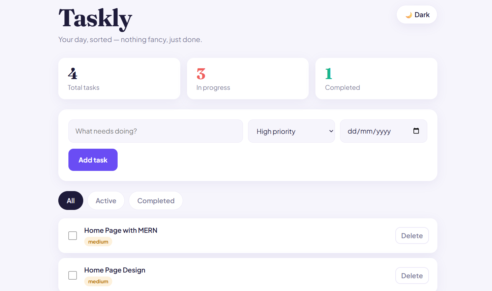
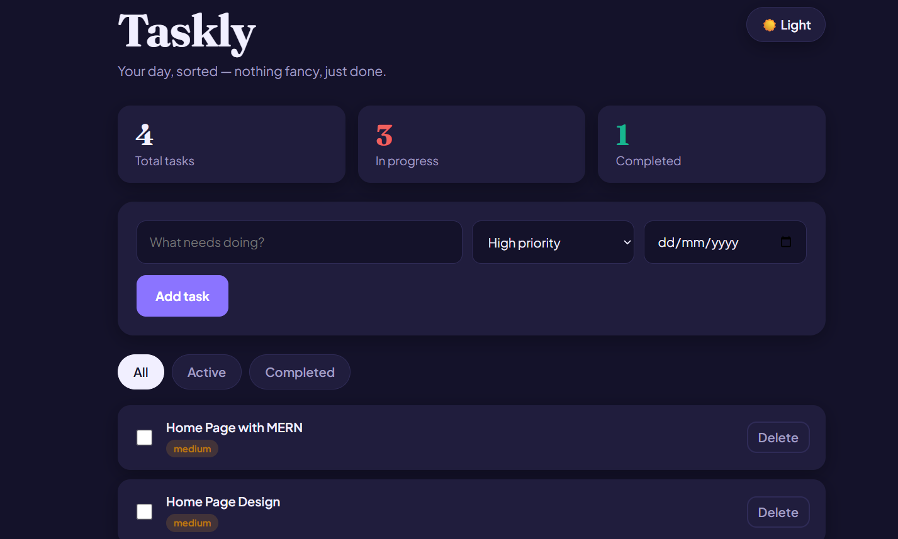
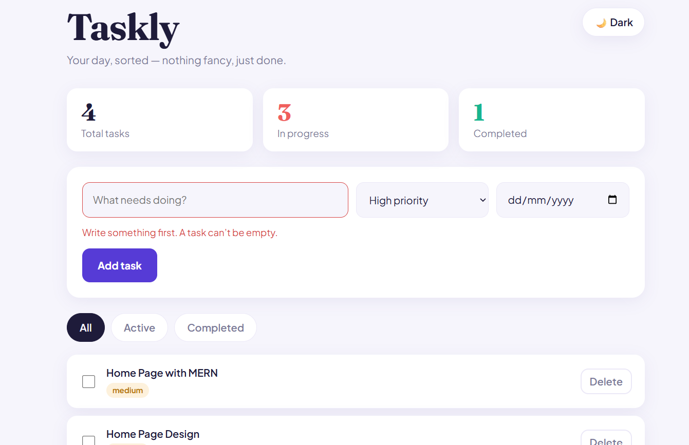
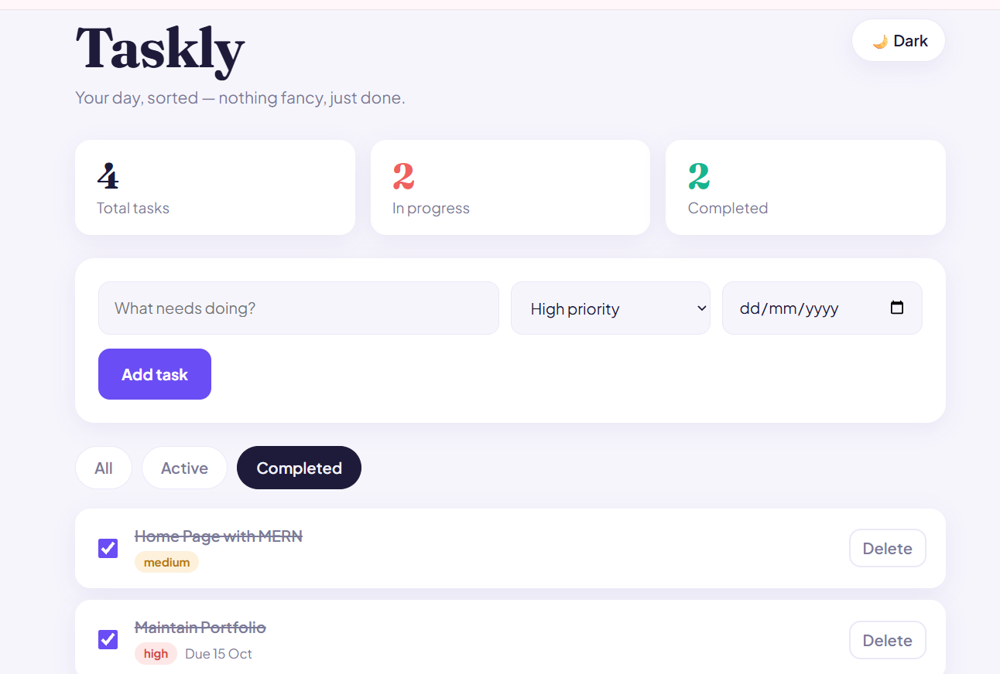

# Taskly – React Task Manager (Part 1)

**AUREX Full-Stack Internship · Month 2 · Week 1**

A component-driven rebuild of my Month 1 JavaScript Task Manager using **React.js + Vite**. It covers JSX, reusable functional components, props, `useState` and controlled forms.

🔗 **Live Demo:** [ADD YOUR VERCEL / NETLIFY LINK HERE](https://github.com/amna-18/week-1-react-task-manager.git)

## Screenshots

| Light mode | Dark mode |
|---|---|
|  |  |

| Validation error | Filters |
|---|---|
|  |  |

## Features

- **Add tasks** through a controlled form input (with priority and due date)
- **Display tasks dynamically** using `.map()` with unique `key` props
- **Toggle completion** with a checkbox (completed tasks are struck through)
- **Delete tasks** from the list state
- **Input validation**: empty or spaces-only tasks are rejected with an error message
- **Live stats**: total, in progress and completed counts
- **Filters**: All / Active / Completed
- **Dark / Light theme** toggle

## Component Hierarchy

```
App                  (owns all state)
├── Header           (title, stats, theme button)
├── TaskForm         (controlled inputs, validation, submission)
├── FilterBar        (All / Active / Completed)
└── TaskList         (maps through the tasks array)
    └── TaskItem     (single task: checkbox, badge, delete)

## State Flow

All shared state lives in `App` using `useState`:

| State | Purpose |
|---|---|
| `tasks` | Array of task objects `{ id, text, priority, dueDate, completed }` |
| `filter` | Current view: `all`, `active` or `completed` |
| `theme` | `light` or `dark` |

- **Data flows down** through props: `App` passes `tasks`, counts and `filter` to its children.
- **Actions flow up** through function props: children call `onAddTask`, `onToggleTask`, `onDeleteTask`, `onChangeFilter` and `onToggleTheme`. `App` updates the state and React re-renders.
- `TaskForm` keeps its own local state (`text`, `priority`, `dueDate`, `error`) because only the form needs it.
- The visible list is **derived** from `tasks` and `filter` instead of being stored separately, so the data can never get out of sync.
- State is always updated **immutably** using `map`, `filter` and the spread operator.

## Tech Stack

- React 19
- Vite
- CSS (custom properties for theming)
- ESLint

## Getting Started

**Requirements:** Node.js and npm.

bash
# 1. Clone the repository
git clone https://github.com/amna-18/week-1-react-task-manager.git

# 2. Go into the client folder
cd week-1-react-task-manager/client

# 3. Install dependencies
npm install

# 4. Start the development server
npm run dev


Then open `http://localhost:5173` in your browser.

To create a production build:

bash
npm run build

## Project Structure

week-1-react-task-manager/
├── client/
│   ├── public/
│   ├── src/
│   │   ├── components/
│   │   │   ├── Header.jsx
│   │   │   ├── TaskForm.jsx
│   │   │   ├── FilterBar.jsx
│   │   │   ├── TaskList.jsx
│   │   │   └── TaskItem.jsx
│   │   ├── App.jsx
│   │   ├── index.css
│   │   └── main.jsx
│   ├── index.html
│   ├── package.json
│   └── vite.config.js
├── screenshots/
├── server/            (empty for now, used in later weeks)
└── README.md
```

## What I Learned

- The difference between React's declarative approach and vanilla JavaScript DOM manipulation
- Setting up a project with Vite and understanding `package.json`, `src/` and `App.jsx`
- Writing JSX and building reusable functional components
- Passing data down with props and passing functions down for child-to-parent communication
- Managing UI state with `useState` and lifting state up
- Handling events (`onClick`, `onChange`, `onSubmit`) and building controlled forms with validation
- Why list items need stable, unique `key` props
- Updating state immutably instead of mutating arrays

## Author

**Amna** · AUREX Full-Stack Internship
GitHub: [amna-18](https://github.com/amna-18/week-1-react-task-manager.git)